# Shoux-Kream 소개 페이지입니다.
**Java + Spring + MySQL + Spring Boot + HTML5 + CSS3 + JS + Vue.js**를 사용한 웹 애플리케이션

## 🖥️ 프로젝트 소개 ##
본 웹사이트는 크림 사이트를 참고하여 구현되었습니다.

## 개발 기간 ##
- 2024.09.30 ~ 2024.10.24

## 🧑‍🤝‍🧑 개발 인원 ##
이하 인원이 개발하였습니다:

- **User**: 안송희
- **Admin**: 김준수
- **Item**: 박유찬
- **Category**: 한선규
- **Cart**: 한현
- **Order**: 고준수

## ⚙️ 개발 환경 ##
- **Java**: Java 17
- **Framework**: Spring Boot 3.3.4
- **Database**: MySQL, H2
- **ORM**: Hibernate Validator, Hibernate Spatial
- **CI/CD**: Jenkins

## <b>프로젝트 상세내용</b> ##
### <b>구현목표</b> ###
> 사용자 페이지
1. 로그인, 로그아웃
2. 구매하기, 판매하기
3. 장바구니 담기(취소)
4. 결제하기(취소)
  
>관리자 페이지
1. 회원관리(회원가입, 회원탈퇴, 블랙리스트, 화이트리스트)
2. 회원, 사용자, 주문 관(삭제)
3. 카테고리 관리(등록, 수정, 삭제)
4. 상품관리(상품 등록, 수정, 삭제)
  
## <b> 어려웠던 부분 </b> ##
- 팀원들과 소통하고 문제를 해결해나가는 과정
  

## <b> 성장한 부분 </b> ##
- 개발자 입장에선 서비스가 완성되었지만, 사용자 입장에서는 많이 부족할때가 많다는 것을 알게 되었습니다.
  

## <b> 보완할 점 </b> ##
- 상품 구매시 사이즈 추가 기능과 입찰 기능을 보완할 예정입니다.
  
## <b> ERD </b> ##
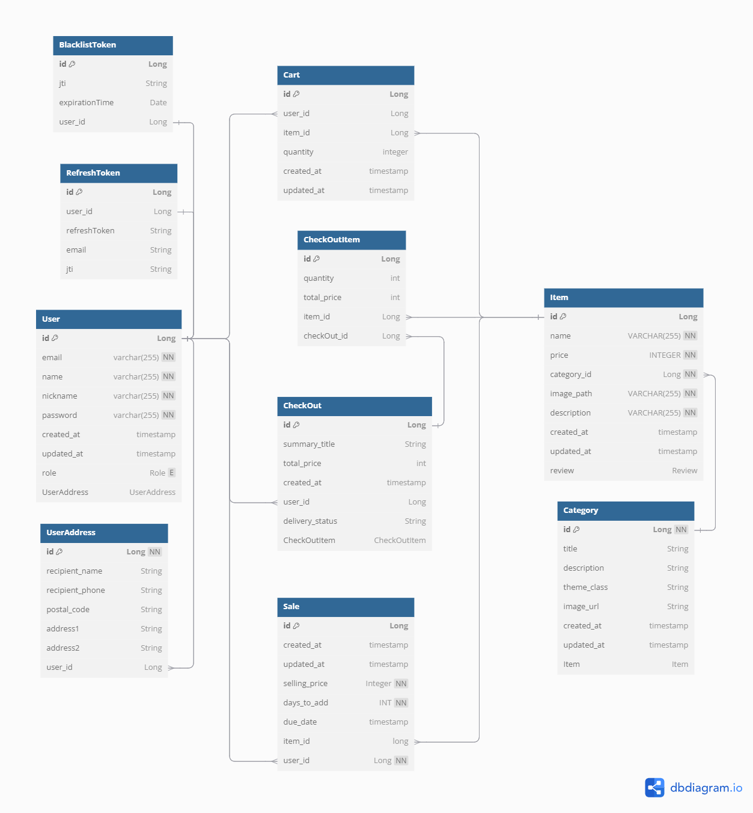
  

## <b>구동 화면</b> ##
> 사용자 페이지
* 메인
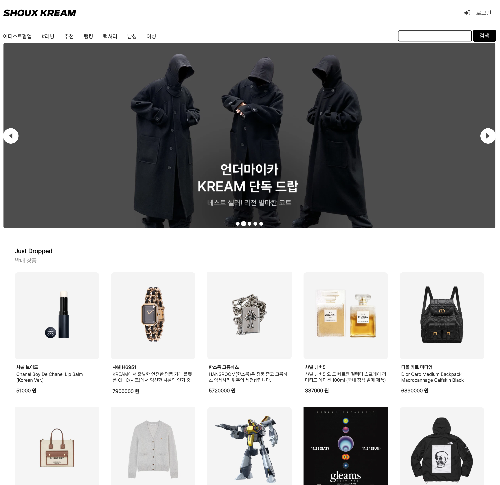
  
* 로그인
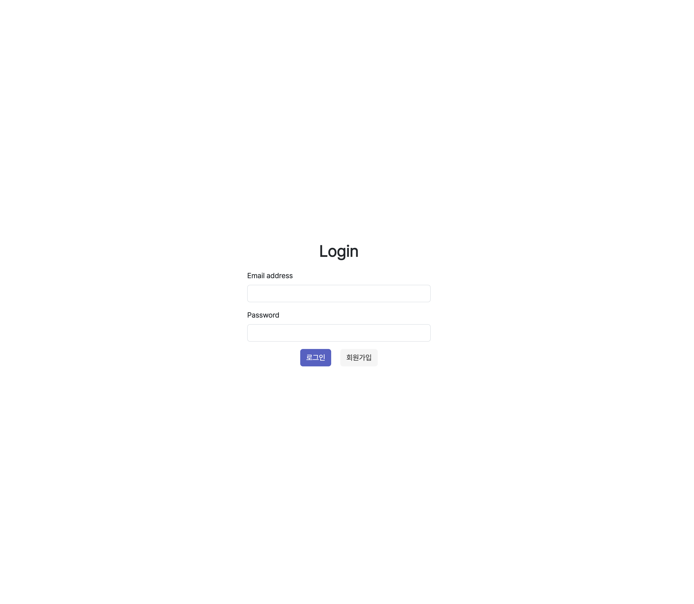
  
* 상품
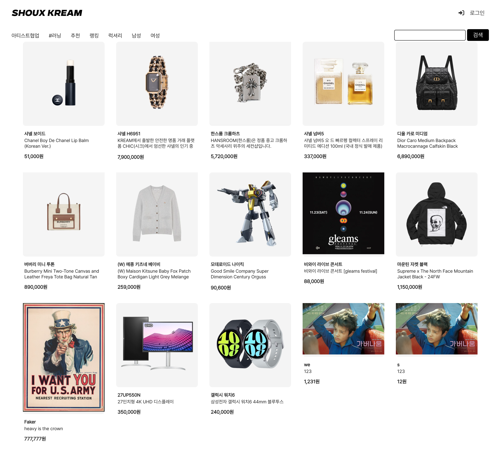
  
* 상품 상세 정보
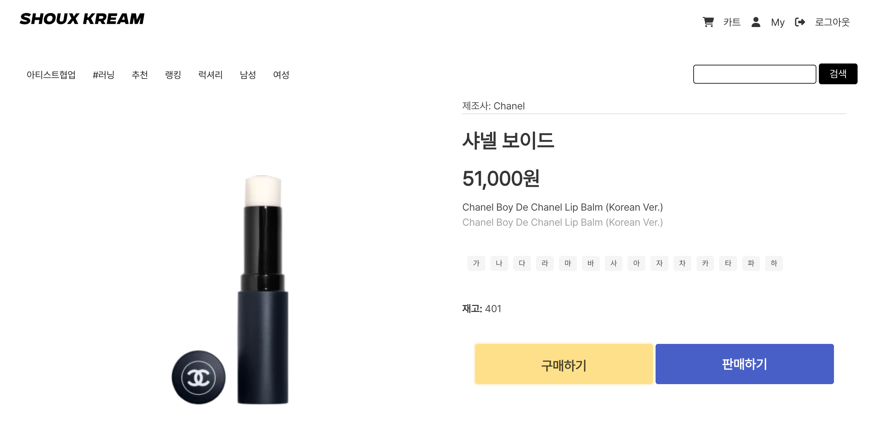
  
* 상품 구매하기
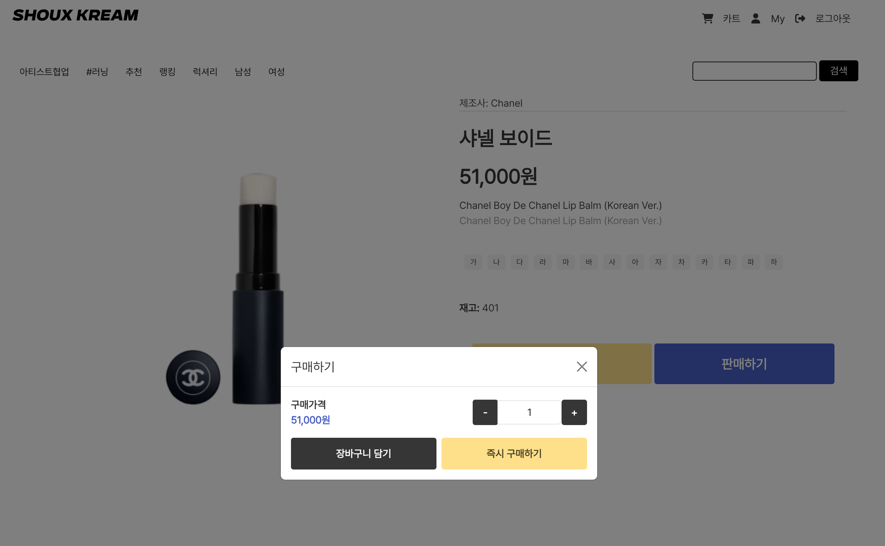
  
* 상품 판매하기
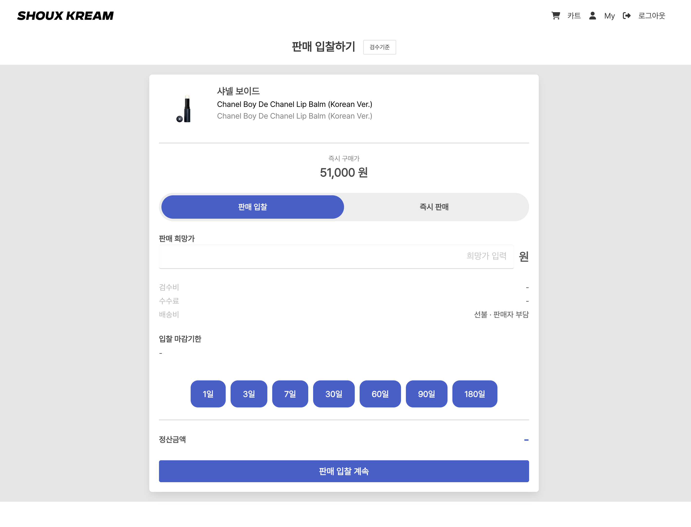
  

> 관리자 페이지
* 주문 관리
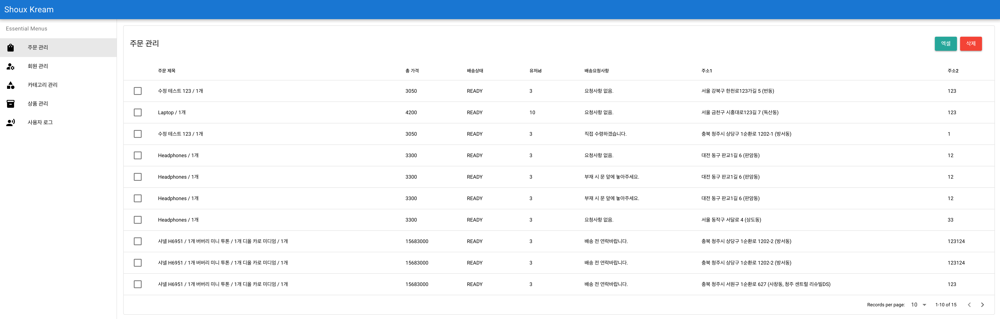
  
* 회원 관리
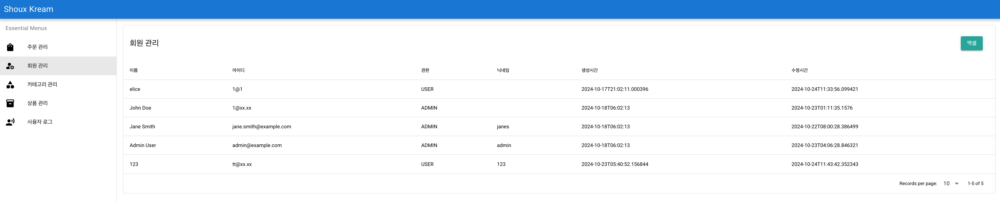
  
* 카테고리 관리
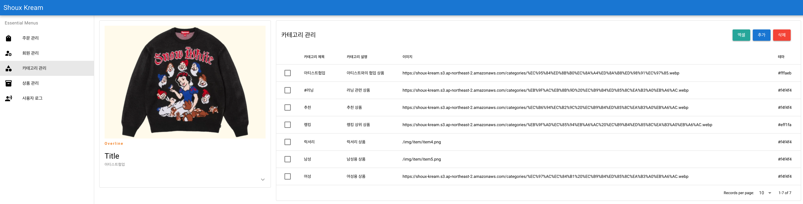
  
* 상품 관리
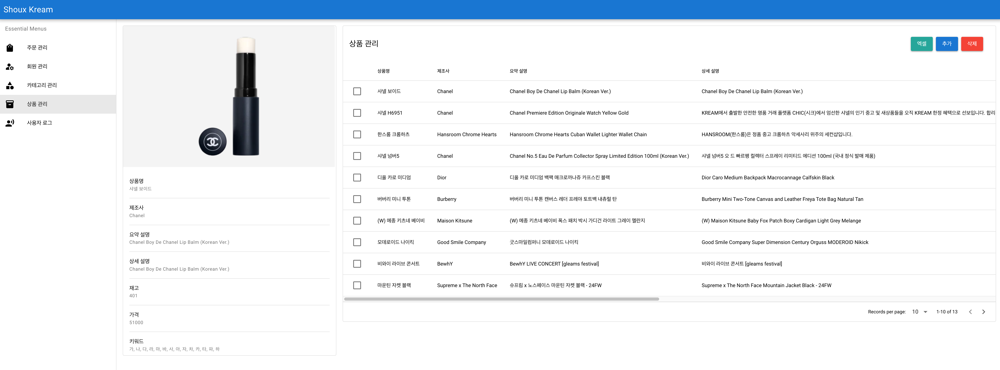
  
* 사용자 로그
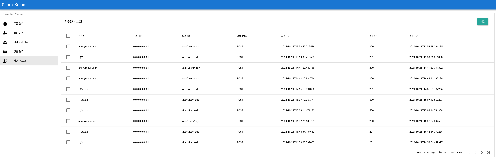
  